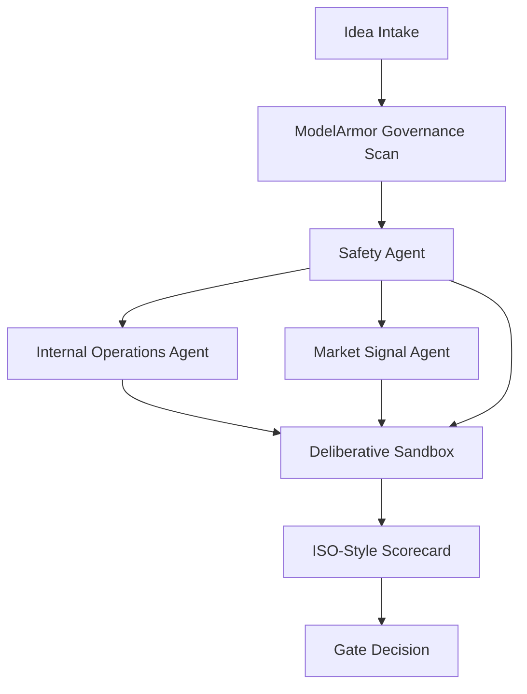
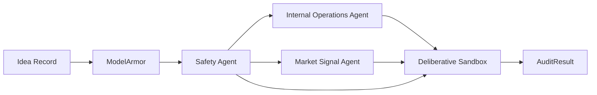

# agentic-ai-funnel-audit

A focused starter project for decision support in enterprise innovation. This repository solves a common early-funnel problem:

- too many ideas are evaluated by opinion rather than objective risk signals
- executive bias and HiPPO decisions dominate early-stage screening
- engineering budgets are wasted when ideas move forward without operational, market, or governance validation

This project turns those early funnel concepts into a defensible, audit-ready scorecard.

## Where a CTAIO can use this

This pattern is especially useful for a Chief Technology and AI Officer when the challenge is not ideation but disciplined prioritization. It helps turn early-stage innovation ideas into auditable decisions before engineering spend begins.

Typical use cases include:
- **Innovation portfolio screening**: evaluate which AI ideas should move forward before engineering investment
- **Transformation program triage**: compare competing initiatives across feasibility, business value, and operating risk
- **Capability investment decisions**: identify whether a proposal is blocked by weak data, unclear ownership, or poor fit
- **Technology due diligence**: assess vendor ideas, platform bets, or AI pilots with a standardized scorecard
- **Digital operating model reviews**: test whether new initiatives align with existing workflow and operating constraints
- **Executive decision support**: replace gut-feel reviews with a traceable, auditable evaluation process

## Why this is useful

This repo is not a generic idea generator. It is a decision support layer that:
- makes early funnel evaluation consistent and auditable
- breaks executive bias by splitting assessment across specialist agents
- captures safety and governance signals before ideas move to engineering
- turns fuzzy innovation proposals into transparent, weighted decision outcomes

## Entry point

The primary entry point is the `AuditPipeline` in `src/agentic_ai_funnel_audit/pipeline.py`.

This root agent is responsible for:
- receiving an idea payload and execution context
- running governance inspections through `ModelArmor`
- computing safety risk with `SafetyAgent`
- delegating internal and market assessments to specialized subagents
- aggregating scores through `DeliberativeSandbox`
- mapping outputs to ISO-style audit scores
- returning a gate/pass decision that leadership can trust

## ADK framework and extensibility

This repository follows a lightweight Agent Development Kit (ADK) pattern:

- each agent is a self-contained evaluation unit with a defined `evaluate()` method
- new agents can be added by implementing the same interface and plugging them into `AuditPipeline`
- agent inputs and outputs are structured as dictionaries and `AgentEvaluation` objects
- this format makes it easy to add new risk lenses without changing core orchestration logic

### New agent format

A new agent should provide:
- a unique `name`
- an `evaluate(idea, context)` implementation
- an `AgentEvaluation` result containing `score`, `rationale`, and `details`

Example:

```python
class NewRiskAgent(Agent):
    def __init__(self):
        super().__init__("New Risk Agent")

    def evaluate(self, idea, context):
        return AgentEvaluation(
            name=self.name,
            score=4,
            rationale="...",
            details={"example": True},
        )
```

## Root agent and sub-agent responsibilities

### Root agent: `AuditPipeline`
- orchestrates the evaluation flow
- ensures every idea passes through governance and safety before decision scoring
- combines multiple agent views into a single objective outcome

### Subagents
- **ModelArmor** (`src/agentic_ai_funnel_audit/governance.py`)
  - acts as a governance and model-safety guardrail
  - checks idea content for missing context, proprietary language, and other risk signals
  - does not serve as a jailbreak tool in this design; it is a policy checker for idea intake
- **Safety Agent** (`src/agentic_ai_funnel_audit/governance.py`)
  - detects proprietary or sensitive terms in idea descriptions
  - adds a safety score into the gate decision
- **Internal Operations Agent** (`src/agentic_ai_funnel_audit/agents.py`)
  - evaluates dependencies, workflow overlap, and data maturity
  - identifies operational risk before engineering begins
- **Market Signal Agent** (`src/agentic_ai_funnel_audit/agents.py`)
  - evaluates trends, competitor signals, and market risk
  - highlights external validation and opportunity risk
- **Deliberative Sandbox** (`src/agentic_ai_funnel_audit/agents.py`)
  - aggregates specialized scores
  - simulates a deliberation debate to detect weak-link risk

## Dataflow



## Root subagent dataflow



  ## Production architecture direction

  The local working demo now uses `demo_kb/` as a stand-in for what should become **domain-owned, asynchronously refreshed RAG memory** in production. The design target is not a synchronous loop that asks a user to self-score an idea. The design target is a production system where each subagent reads authoritative enterprise evidence and infers readiness, blockers, and investment path.

  ### Part 1: The Multi-Agent Orchestration Mesh

  Foundational agent patterns such as supervisor-worker routing and sequential ReAct loops are useful for prototypes, but they become fragile under enterprise throughput. A slow model response or tool timeout can block the whole chain. The production direction for this app is an **asynchronous actor mesh** over an event backbone.

  ```mermaid
  flowchart TD
    A[Inbound idea request] --> B[Task Router Actor]
    B --> C[Strategic Domain Actor]
    B --> D[Data Domain Actor]
    B --> E[Technology Domain Actor]
    B --> F[Market Domain Actor]
    B --> G[Governance Domain Actor]
    C --> H[Decision Aggregator]
    D --> H
    E --> H
    F --> H
    G --> H
    H --> I[Scorecard, route, and human escalation]
  ```

  Production pattern:
  - The router should publish work to domain queues instead of invoking all workers in one blocking thread.
  - Each subagent should run as an isolated actor with its own state, retry policy, and queue depth.
  - Loop guards should stop non-deterministic correction cycles and escalate to a human reviewer.
  - The platform should support both a single idea and a batch of ideas. The API now exposes `POST /audit` and `POST /audit/batch` to reflect both modes.

  ### Part 2: The Enterprise Memory Fabric

  Standard vector-only RAG is not enough for enterprise decision systems. The platform should use a **multi-tier hybrid memory stack** so that semantic recall and explicit business structure are both preserved.

  ```mermaid
  flowchart TD
    A[Idea facts] --> B[Agent query builder]
    B --> C[Transient layer: Redis or cache]
    B --> D[Semantic layer: Vector database]
    B --> E[Relational layer: Graph database]
    C --> F[Context pruning and weighting]
    D --> F
    E --> F
    F --> G[Grounded agent reasoning]
  ```

  Recommended memory stack:
  - `Transient layer`: active session state, locks, queue claims, and warm handover payloads.
  - `Semantic layer`: embeddings for policies, strategy documents, operational notes, market research, and historical decisions.
  - `Relational layer`: organizational hierarchy, system dependencies, data lineage, capability maps, and ownership graphs.

  Priority calculation for context pruning:

  $$
  	ext{Priority} = (\text{Semantic Relevance} \times 0.5) + (\text{Recency Decay} \times 0.3) + (\text{Graph Entity Proximity} \times 0.2)
  $$

  In the working demo, `demo_kb/` holds markdown files for each domain. In production, those domains should be populated asynchronously from company-owned systems:
  - strategy agent: strategy office documents, OKRs, portfolio priorities
  - data readiness agent: data catalog, lineage, stewardship reviews, quality dashboards
  - technology readiness agent: CMDB, telemetry, service availability, platform constraints, delivery capacity
  - market agent: external analyst feeds, news, earnings calls, CRM notes, win-loss reviews, support signals
  - governance agent: policy repository, data classification rules, AI risk controls, audit findings

  Each domain RAG must be maintained asynchronously by the responsible team, not by end users entering scores in the app.

  ### Part 3: Tool Federation and Day-2 Operations

  In production, subagents should never hold direct credentials to internal systems. Tool use must be wrapped in a zero-trust execution layer.

  ```mermaid
  flowchart LR
    A[AI Agent] --> B[MCP Server]
    B --> C[Enterprise Gateway]
    C --> D[Operational systems]
    C --> E[Provisioning and data services]
  ```

  Production pattern:
  - use federated MCP tool access behind a secure proxy
  - validate every tool payload against deterministic schemas before it leaves the agent boundary
  - route tool execution through an API gateway with OAuth 2.0 and RBAC
  - trigger warm human handover when confidence drops or retry thresholds are crossed
  - use OpenTelemetry for multi-hop tracing across routing, retrieval, model, and tool execution

  ## KB-backed agent design

  The current app now moves toward this model:
  - users submit idea facts, not self-scores
  - strategic, data, technology, market, and governance agents retrieve evidence from the knowledge base
  - the pipeline returns score, evidence, and an investment route
  - a strong idea with weak readiness can be recommended as `fund_foundation_first` instead of being rejected outright

  ## How external trends should be checked

  The market agent should combine both macro and micro signals.

  Macro factors:
  - cost pressure
  - productivity mandates
  - regulatory direction
  - AI governance expectations
  - sector-wide investment shifts

  Micro factors:
  - competitor launches
  - win-loss commentary
  - CRM notes
  - support pain signals
  - product telemetry shifts
  - workflow bottlenecks in a target business unit

  Recommended production flow:
  1. ingest external trend summaries from analyst research, trusted news, earnings calls, and market reports into the market RAG asynchronously
  2. ingest internal demand signals from CRM, support, product, and sales systems into the same domain RAG with metadata tags
  3. tag each record with `industry`, `time_horizon`, `macro_factors`, `micro_factors`, and `business_capability`
  4. require the market agent to cite both macro and micro evidence before assigning a strong score

  ## Domain ownership and asynchronous KB maintenance

  The demo KB files now include ownership and refresh metadata to make the production direction explicit. You can inspect this in the UI and through `GET /knowledge-base/status`.

  Expected production ownership model:
  - strategy office maintains strategy RAG asynchronously on a monthly or quarterly cadence
  - data team maintains maturity, quality, and lineage RAG asynchronously on a weekly cadence
  - platform and architecture teams maintain infrastructure and service readiness RAG asynchronously on a daily cadence
  - market intelligence and commercial teams maintain trend RAG asynchronously from external and internal feeds
  - risk and governance teams maintain policy and control RAG asynchronously from official repositories

## Scoring semantics and gate policy

All scores in this project use the same direction: **higher is better** on a 1-5 scale.

  - **Strategic Alignment**: derived from strategy evidence, with optional explicit override for testing.
  - **Constraint Fit**: average readiness from data, internal operations, and market perspectives.
- **Technical Feasibility**: direct mapping from internal operational readiness.
- **Compliance Readiness**: direct mapping from safety score.

Gate decision is intentionally stricter than an overall weighted average. An idea passes only when all of the following are true:
- final score is at or above `approval_threshold` (default: 3)
- Strategic Alignment >= 3
- Constraint Fit >= 3
- Technical Feasibility >= 3
- Compliance Readiness >= 3
- governance guardrail returns safe

This avoids a scenario where one weak domain is hidden by strong scores in other domains.

## What this repo contains

- `src/agentic_ai_funnel_audit/agents.py` — operational, market, and deliberative agent logic
- `src/agentic_ai_funnel_audit/governance.py` — governance and content safety checks
- `src/agentic_ai_funnel_audit/pipeline.py` — the root audit orchestration pipeline
- `src/agentic_ai_funnel_audit/modeling.py` — optional model-driven scoring with OpenAI integration
- `src/agentic_ai_funnel_audit/storage.py` — in-memory audit history and override persistence
- `src/agentic_ai_funnel_audit/connectors.py` — pluggable data connectors for operational telemetry, incidents, backlog, and architecture metadata
- `src/agentic_ai_funnel_audit/outcomes.py` — outcome tracking and feedback loop calibration
- `src/agentic_ai_funnel_audit/api.py` — FastAPI service with audit, enrichment, outcomes, and calibration endpoints
- `src/agentic_ai_funnel_audit/cli.py` — CLI for file-based audit runs and JSON exports
- `src/agentic_ai_funnel_audit/demo.py` — a runnable demo for the audit workflow
- `terraform/` — production-ready GCP infrastructure as code (Cloud Run, Artifact Registry, Secret Manager, Pub/Sub, Cloud Storage)
- `GCP_DEPLOYMENT.md` — step-by-step GCP deployment guide
- `tests/` — automated pytest coverage for pipeline, API, governance, and connectors

## How to run locally

```bash
python -m src.agentic_ai_funnel_audit.demo
```

The API can also be run via the FastAPI service:

```bash
uvicorn agentic_ai_funnel_audit.api:app --host 0.0.0.0 --port 8000
```

Available endpoints:
- `GET /` - health check
- `POST /audit` - submit an idea + context for audit scoring
- `POST /audit/batch` - submit a batch of ideas for audit scoring
- `GET /audits` - list saved audit entries
- `GET /audit/{idea_id}` - retrieve a saved audit entry
- `GET /audit/{idea_id}/artifact` - download the formal audit artifact
- `GET /audit/{idea_id}/enrich` - fetch enriched context from operational data sources (requires `service_id` and `team_id` query params)
- `POST /audit/{idea_id}/override` - apply an executive override to a saved audit
- `GET /knowledge-base/status` - inspect domain ownership and refresh metadata for KB-backed agents
- `GET /dashboard` - HTML dashboard with audit history
- `POST /outcomes` - record an outcome for a completed idea
- `GET /outcomes` - list all recorded outcomes
- `GET /outcomes/{idea_id}` - get outcome for a specific idea
- `GET /calibration` - get feedback loop calibration factors

If you want model-driven scoring, set environment variables before running the service:
- `OPENAI_API_KEY` - your OpenAI credential
- `AGENTIC_USE_MODEL=true` - enable the optional scoring model
- `AGENTIC_MODEL_NAME` - optional model name, defaults to `gpt-4o-mini`

### Free Groq key for demo use

If you want a no-cost demo model, use Groq's free tier:

1. Go to [console.groq.com](https://console.groq.com)
2. Sign in or create an account
3. Open the API keys page in the console
4. Create a new key and copy it once
5. Set it in PowerShell before starting the app:

```powershell
$env:GROQ_API_KEY = "your-groq-key"
python -m agentic_ai_funnel_audit.ui.app
```

Suggested demo models:
- `llama-3.3-70b-versatile`
- `llama-3.1-8b-instant`

You do not need `OPENAI_API_KEY` for the demo if `GROQ_API_KEY` is set.

### Demo cases you can use

Use the Flask UI buttons to load three working examples:
- a strong idea that should pass
- a strategically strong idea that should recommend `fund_foundation_first`
- a governance-failing idea that should be blocked

## Manager UI (Intake + Gate)

A small Flask-based manager UI is included for intake and gate decisions. It uses the in-memory `AuditStore`.

Run the UI from the repository root:

```bash
python -m agentic_ai_funnel_audit.ui.app
```

Or, run directly from the `ui` folder:

```bash
python ui/app.py
```

Default host: `http://0.0.0.0:5000` — pages:
- `/intake` — Ideal Intake form
- `/dashboard` — Gate decision dashboard and entry review

Notes:
- This is a lightweight scaffold intended for MVP and internal manager use. For production deploy, containerize the app and wire `AuditStore` to persistent storage.
- `demo_kb/` is a working demo. In production, replace it with asynchronously refreshed RAG stores owned by the relevant business and platform teams.


## Deploy on GCP

This project is well-suited for a simple GCP container deployment:

1. containerize the app with a `Dockerfile`
2. build and push the image to Artifact Registry or Container Registry
3. deploy it to Cloud Run for serverless execution, or Cloud Run on GKE for more control

A recommended GCP stack:
- **Artifact Registry** for storing container images
- **Cloud Build** for CI/CD packaging
- **Cloud Run** for scalable serverless deployment
- **Secret Manager** for any credentials or model keys
- **Pub/Sub** or **Workflows** if you want to connect the idea intake pipeline to external event streams

### Example deployment flow

```bash
gcloud auth login
gcloud config set project YOUR_GCP_PROJECT
gcloud builds submit --tag us-central1-docker.pkg.dev/YOUR_GCP_PROJECT/agentic-ai-funnel-audit/agentic-ai-funnel-audit:latest
gcloud run deploy agentic-ai-funnel-audit \
  --image us-central1-docker.pkg.dev/YOUR_GCP_PROJECT/agentic-ai-funnel-audit/agentic-ai-funnel-audit:latest \
  --region us-central1 \
  --platform managed \
  --allow-unauthenticated
```

If you want to deploy as part of a data-driven funnel, add a Cloud Run trigger for Pub/Sub or HTTP event input.

## Completed features

- ✅ model-driven and prompt-based evaluation through optional OpenAI integration
- ✅ leader-facing API and dashboard for reviewing gate results, overrides, and audit trails
- ✅ formal audit artifacts and exportable compliance reports
- ✅ policy hooks for organization-specific scoring weights and approval thresholds
- ✅ feedback loop infrastructure with outcome tracking and recommendation calibration
- ✅ CLI for batch processing and JSON exports
- ✅ pluggable operational data connectors (telemetry, incidents, backlog, architecture)
- ✅ event-driven ingestion via Pub/Sub
- ✅ production-ready GCP deployment (Cloud Run, Artifact Registry, Secret Manager)

## Production Deployment

See [GCP_DEPLOYMENT.md](GCP_DEPLOYMENT.md) for detailed instructions on deploying to Google Cloud Platform.

Quick steps:
1. Build and push the container image to Artifact Registry
2. Use Terraform to provision Cloud Run, secrets, and event-driven infrastructure
3. Set secret values for API keys and data source configurations
4. Access the service via the Cloud Run URL

## Next steps

1. replace the markdown demo KB with vector, graph, and cache-backed enterprise memory services
2. ingest strategy, data, market, and platform evidence asynchronously from authoritative company systems
3. move routing and subagent execution to an event-driven actor mesh for higher throughput and stronger fault isolation
4. wrap tools behind MCP and a zero-trust gateway with schema validation, RBAC, and OpenTelemetry tracing

## License

MIT
