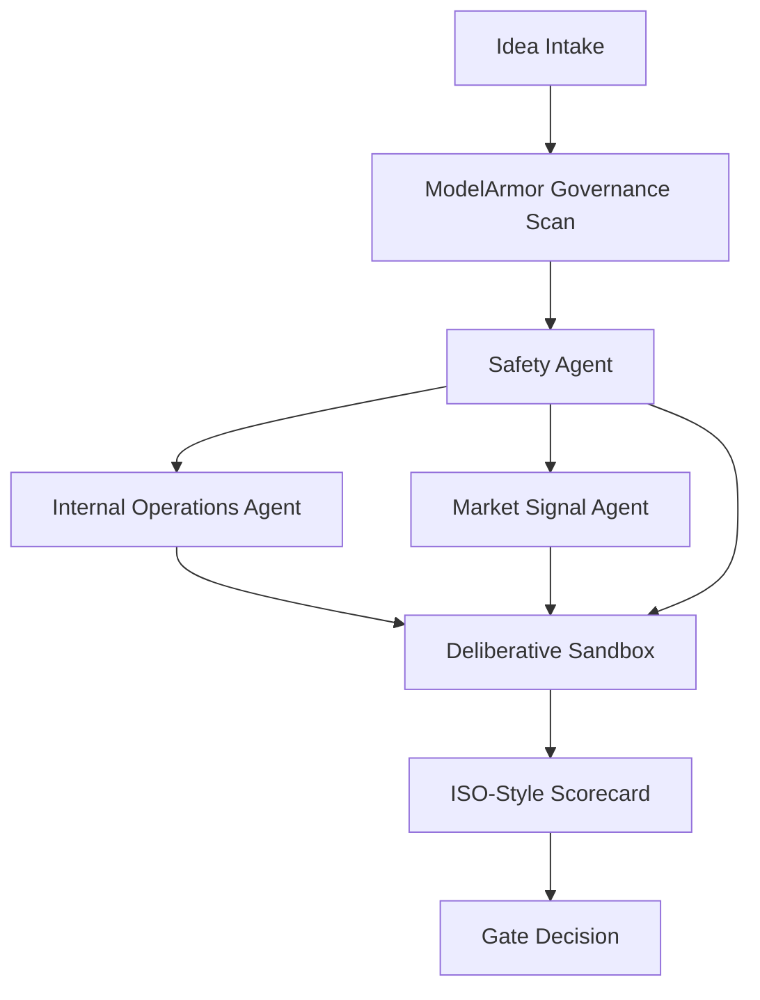
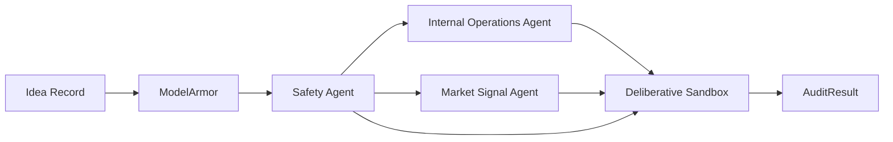

# agentic-ai-funnel-audit

A focused starter project for decision support in enterprise innovation. This repository solves a common early-funnel problem:

- too many ideas are evaluated by opinion rather than objective risk signals
- executive bias and HiPPO decisions dominate early-stage screening
- engineering budgets are wasted when ideas move forward without operational, market, or governance validation

This project turns those early funnel concepts into a defensible, audit-ready scorecard.

## Where a CTAIO can use this

This pattern is especially useful for a Chief Technology and AI Officer when the challenge is not ideation but disciplined prioritization. It helps turn early-stage innovation ideas into auditable decisions before engineering spend begins.

Typical use cases include:
- **Innovation portfolio screening**: evaluate which AI ideas should move forward before engineering investment
- **Transformation program triage**: compare competing initiatives across feasibility, business value, and operating risk
- **Capability investment decisions**: identify whether a proposal is blocked by weak data, unclear ownership, or poor fit
- **Technology due diligence**: assess vendor ideas, platform bets, or AI pilots with a standardized scorecard
- **Digital operating model reviews**: test whether new initiatives align with existing workflow and operating constraints
- **Executive decision support**: replace gut-feel reviews with a traceable, auditable evaluation process

## Why this is useful

This repo is not a generic idea generator. It is a decision support layer that:
- makes early funnel evaluation consistent and auditable
- breaks executive bias by splitting assessment across specialist agents
- captures safety and governance signals before ideas move to engineering
- turns fuzzy innovation proposals into transparent, weighted decision outcomes

## Entry point

The primary entry point is the `AuditPipeline` in `src/agentic_ai_funnel_audit/pipeline.py`.

This root agent is responsible for:
- receiving an idea payload and execution context
- running governance inspections through `ModelArmor`
- computing safety risk with `SafetyAgent`
- delegating internal and market assessments to specialized subagents
- aggregating scores through `DeliberativeSandbox`
- mapping outputs to ISO-style audit scores
- returning a gate/pass decision that leadership can trust

## ADK framework and extensibility

This repository follows a lightweight Agent Development Kit (ADK) pattern:

- each agent is a self-contained evaluation unit with a defined `evaluate()` method
- new agents can be added by implementing the same interface and plugging them into `AuditPipeline`
- agent inputs and outputs are structured as dictionaries and `AgentEvaluation` objects
- this format makes it easy to add new risk lenses without changing core orchestration logic

### New agent format

A new agent should provide:
- a unique `name`
- an `evaluate(idea, context)` implementation
- an `AgentEvaluation` result containing `score`, `rationale`, and `details`

Example:

```python
class NewRiskAgent(Agent):
    def __init__(self):
        super().__init__("New Risk Agent")

    def evaluate(self, idea, context):
        return AgentEvaluation(
            name=self.name,
            score=4,
            rationale="...",
            details={"example": True},
        )
```

## Root agent and sub-agent responsibilities

### Root agent: `AuditPipeline`
- orchestrates the evaluation flow
- ensures every idea passes through governance and safety before decision scoring
- combines multiple agent views into a single objective outcome

### Subagents
- **ModelArmor** (`src/agentic_ai_funnel_audit/governance.py`)
  - acts as a governance and model-safety guardrail
  - checks idea content for missing context, proprietary language, and other risk signals
  - does not serve as a jailbreak tool in this design; it is a policy checker for idea intake
- **Safety Agent** (`src/agentic_ai_funnel_audit/governance.py`)
  - detects proprietary or sensitive terms in idea descriptions
  - adds a safety score into the gate decision
- **Internal Operations Agent** (`src/agentic_ai_funnel_audit/agents.py`)
  - evaluates dependencies, workflow overlap, and data maturity
  - identifies operational risk before engineering begins
- **Market Signal Agent** (`src/agentic_ai_funnel_audit/agents.py`)
  - evaluates trends, competitor signals, and market risk
  - highlights external validation and opportunity risk
- **Deliberative Sandbox** (`src/agentic_ai_funnel_audit/agents.py`)
  - aggregates specialized scores
  - simulates a deliberation debate to detect weak-link risk

## Dataflow



## Root subagent dataflow



## What this repo contains

- `src/agentic_ai_funnel_audit/agents.py` — operational, market, and deliberative agent logic
- `src/agentic_ai_funnel_audit/governance.py` — governance and content safety checks
- `src/agentic_ai_funnel_audit/pipeline.py` — the root audit orchestration pipeline
- `src/agentic_ai_funnel_audit/demo.py` — a runnable demo for the audit workflow
- `tests/` — automated pytest coverage for pipeline and governance behavior

## How to run locally

```bash
python -m src.agentic_ai_funnel_audit.demo
```

The API can also be run via the FastAPI service:

```bash
uvicorn agentic_ai_funnel_audit.api:app --host 0.0.0.0 --port 8000
```

Available endpoints:
- `GET /` - health check
- `POST /audit` - submit an idea + context for audit scoring
- `GET /audits` - list saved audit entries
- `GET /audit/{idea_id}` - retrieve a saved audit entry
- `GET /audit/{idea_id}/artifact` - download the formal audit artifact
- `POST /audit/{idea_id}/override` - apply an executive override to a saved audit

If you want model-driven scoring, set environment variables before running the service:
- `OPENAI_API_KEY` - your OpenAI credential
- `AGENTIC_USE_MODEL=true` - enable the optional scoring model
- `AGENTIC_MODEL_NAME` - optional model name, defaults to `gpt-4o-mini`

## Deploy on GCP

This project is well-suited for a simple GCP container deployment:

1. containerize the app with a `Dockerfile`
2. build and push the image to Artifact Registry or Container Registry
3. deploy it to Cloud Run for serverless execution, or Cloud Run on GKE for more control

A recommended GCP stack:
- **Artifact Registry** for storing container images
- **Cloud Build** for CI/CD packaging
- **Cloud Run** for scalable serverless deployment
- **Secret Manager** for any credentials or model keys
- **Pub/Sub** or **Workflows** if you want to connect the idea intake pipeline to external event streams

### Example deployment flow

```bash
gcloud auth login
gcloud config set project YOUR_GCP_PROJECT
gcloud builds submit --tag us-central1-docker.pkg.dev/YOUR_GCP_PROJECT/agentic-ai-funnel-audit/agentic-ai-funnel-audit:latest
gcloud run deploy agentic-ai-funnel-audit \
  --image us-central1-docker.pkg.dev/YOUR_GCP_PROJECT/agentic-ai-funnel-audit/agentic-ai-funnel-audit:latest \
  --region us-central1 \
  --platform managed \
  --allow-unauthenticated
```

If you want to deploy as part of a data-driven funnel, add a Cloud Run trigger for Pub/Sub or HTTP event input.

## Next steps

1. connect the pipeline to real operational data sources such as service telemetry, incident history, backlog health, and architecture metadata
2. wire `Internal Operations Agent` to a richer context feed so it evaluates dependencies, delivery risk, and run-rate impact more realistically
3. replace placeholder scoring with prompt-driven or model-based evaluation for deeper reasoning, particularly around business value and implementation risk
4. add a leader-facing API and dashboard for reviewing gate results, overrides, and audit trails in one place
5. export results into formal compliance artifacts, board-ready summaries, and portfolio review packs
6. add policy hooks for organization-specific scoring weights, approval thresholds, and review workflows
7. introduce a feedback loop where completed initiatives are scored against outcomes so future recommendations become better calibrated
8. deploy the service into a production-ready GCP stack with Cloud Run, Artifact Registry, Secret Manager, and event-driven ingestion

## License

MIT
