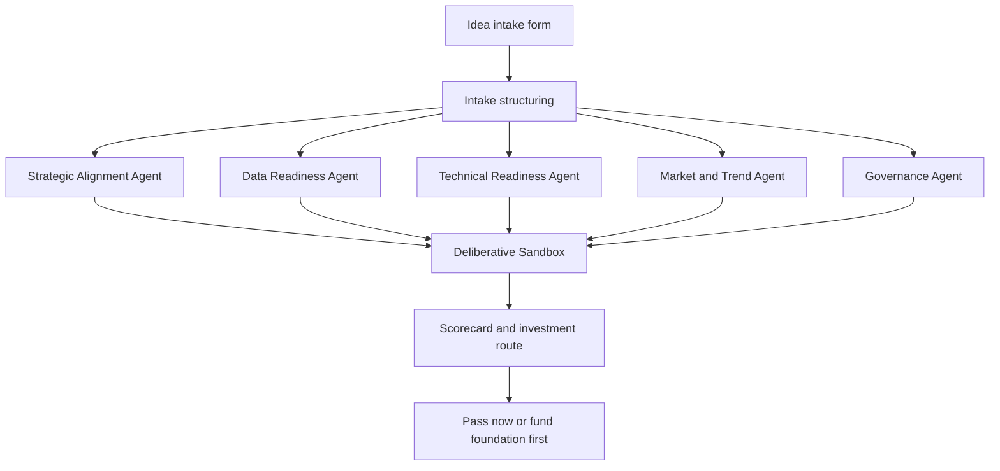
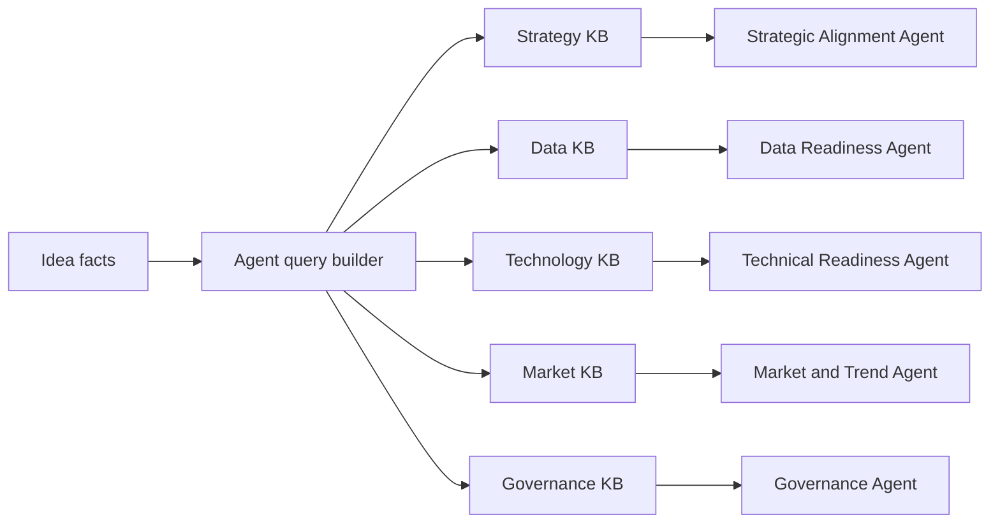

# Multi-Agent RAG Design

This demo shifts the app from self-scored intake toward KB-grounded scoring.

## Role of the LLM

The LLM is not the source of truth. It interprets retrieved enterprise evidence and produces:
- score
- rationale
- confidence and evidence snippets
- blockers
- remediation actions
- investment recommendation

## Agent dataflow

## Retrieval dataflow

## Decision model

Do not collapse idea value and current readiness into one concept.

Use four outputs:
- strategic value
- current readiness
- capability gap
- investment route

Recommended routes:
- `fund_pilot_now`
- `fund_foundation_first`
- `incubate_architecture`
- `retest_market_case`
- `rework_then_resubmit`

## Macro and micro trend checks

The market agent should combine internal and external evidence.

Macro factors:
- budget pressure
- regulatory direction
- productivity mandates
- economic slowdown or expansion
- AI governance expectations

Micro factors:
- competitor launches
- customer churn signals
- sales objections
- support volume changes
- workflow pain in specific business units

Recommended production pattern:
1. Pull external trend summaries from analyst feeds, market research, trusted news, and earnings calls.
2. Pull internal demand signals from CRM notes, win/loss reviews, support tickets, and product telemetry.
3. Normalize them into dated KB documents with tags like `macro_factors`, `micro_factors`, `industry`, and `time_horizon`.
4. Let the market agent retrieve by idea topic, business capability, and industry scope.
5. Require the agent to cite both macro and micro evidence before assigning a strong score.

## Demo KB documents

The working demo docs live under:
- `demo_kb/strategy/`
- `demo_kb/data/`
- `demo_kb/technology/`
- `demo_kb/market/`
- `demo_kb/governance/`
- `demo_kb/templates/`

## Suggested next implementation steps

1. Replace keyword retrieval with embeddings and metadata filters.
2. Add per-agent confidence scoring.
3. Store retrieved evidence in a persistent audit artifact.
4. Add external trend ingestion jobs for market KB refresh.
5. Split technical readiness into architecture, delivery, and operating risk agents.
